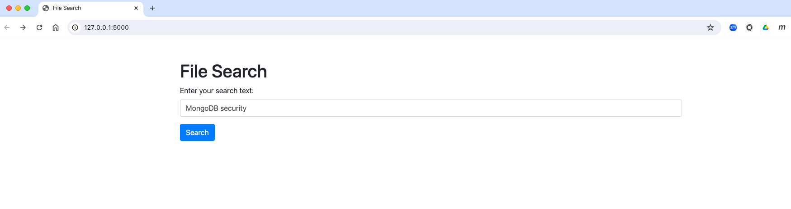
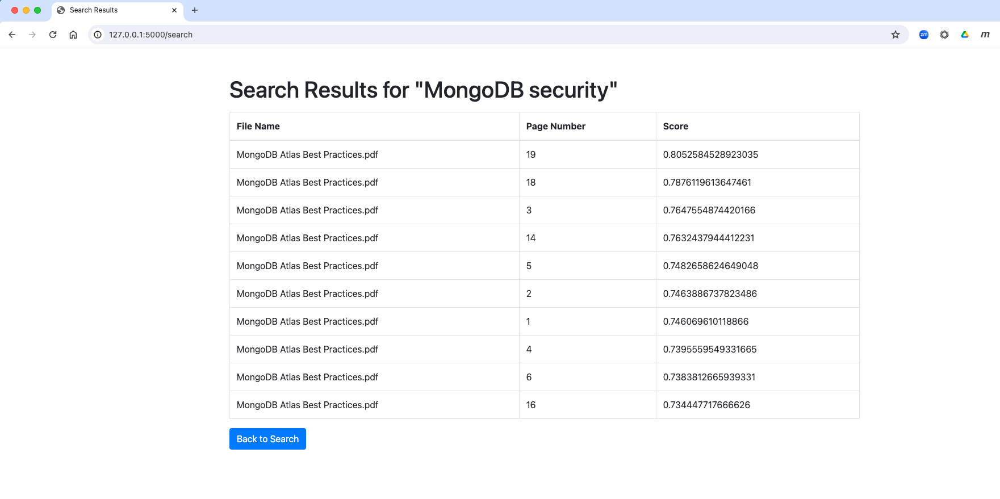

# Load and Search Documents - A simple demo
In this demo we will show how you can build a simple app to search across documents (PDFs, text files, word docs etc) **without** extracting the text, storing it in the database and creating lucene indexes. Instead, we will use embedding models to parse the text and store the vector embeddings in the database (along with the document information) and levarage vector indexes to perform semantic search on the data.

## Setup
This demo uses a simple web application written in python using the [flask](https://flask.palletsprojects.com/en/3.0.x/) framework and leverages the [PyMuPDF](https://pypi.org/project/PyMuPDF/) library to extract text from PDFs (and other supported documents) along with the [all-MiniLM-L6-v2](https://huggingface.co/sentence-transformers/all-MiniLM-L6-v2) transformer from [huggingface](https://huggingface.co) to generate our embeddings. 

Ensure you have python3 installed and run the following to install the necessary dependencies:

```
pip install -U sentence-transformers pymongo Flask requests PyMuPDF
```

You can then use a fully managed [MongoDB Atlas](https://www.mongodb.com/docs/atlas/) environment or the [Atlas CLI](https://www.mongodb.com/docs/atlas/cli/stable/) to set up a local Atlas development environment.

#### Atlas CLI
This dmeo can be run entirely on your laptop using the [Atlas CLI](https://www.mongodb.com/docs/atlas/cli/stable/). To do this, follow the steps in the [docs](https://www.mongodb.com/docs/atlas/cli/stable/atlas-cli-deploy-local/) to install the prerequisites for running Atlas CLI in local development mode.

Then, create the local database by running the following commands and accepting the default values:

```
atlas deployments setup
```

You can view your deployments using this command:

```
atlas deployments list
```

Then locate the connection string for your local Atlas cluster using:
```
atlas deployments connect
```

Use this to update the `MONGODB_URI` connection details in [settings.py](settings.py)

#### MongoDB Atlas
To run this demo using an Atlas cluster, either follow the [getting started](https://www.mongodb.com/docs/atlas/getting-started/) steps to provision your cluster (note this can run on an M0 which is free) or use an existing cluster.

When your cluster is up and running locate the connection URI (from the `connect` button in the Atlas management console) and update the `MONGODB_URI` connection details in [settings.py](settings.py)

#### Load Data
For this demo, any files that need to be loaded into the database must reside in the [files2load](files2load) directory. For the demo I have included the [MongoDB Atlas Best Practices.pdf](<MongoDB Atlas Best Practices.pdf>) but feel free to add any other files that you want to process in this directory.

You can then use the following files to load the data into MongoDB:

- [ingestFiles.py](ingestFiles.py) - will delete all records from the MongoDB collection and will iterate over each file in the directory, parse the text, generate the embeddings and save the data into the database.

- [ingestSingleFile.py](ingestSingleFile.py) - will prompt you for a file name (which has to be located in the [files2load](files2load) directory) and will perform the same operation as above for that specific file.

#### Create Index
You will need to create the vector index before you can search on the data that has been loaded. This can be done in many ways but for this demo, depending on whether you're using Atlas or the Atlas CLI with local development mode, I would suggest you follow these steps:

##### Atlas CLI
Ensure the local instance is up and running. Then create the index using the Atlas CLI with the configuration defined in the [vectorSearchIndex.json](vectorSearchIndex.json) file.

**Note**: if you have changed the name of the database and collection (in [settings.pyt](settings.py)) then ensure you also update the [vectorSearchIndex.json](vectorSearchIndex.json) file to reflect these changes.

Create vector search index using:

```
atlas deployments search indexes create --file vectorSearchIndex.json
```

If you have multiple deployments running locally you will need to specity which deployment to create the index on using the `--deploymentName` option.

This will create the following vector index on the `embedding` field in the docsDB collection in the docs database using the dimensions of the vector embedding (384 in this case):

```
{
    "name": "vectorIndex",
    "type": "vectorSearch",
    "collectionName": "docsDB",
    "database": "docs",
    "fields": [
      {
        "type": "vector",
        "path": "embedding",
        "numDimensions": 384,
        "similarity": "cosine"
      }
    ]
}
```

Your local deployment is now ready to be used for this demo.

##### Atlas UI
If you are running this demo on an Atlas cluster then use the Atlas UI to create a new index on the collection.


To do this, navigate to the Atlas Search tab in the UI and create an index on the `embedding` field of the `docs` collection in the `docDB` database. Be sure to call this index `vectorIndex`. Use the follogin JSON configuration for the index:


```
{
  "fields": [
    {
      "numDimensions": 384,
      "path": "embedding",
      "similarity": "cosine",
      "type": "vector"
    }
  ]
}
```

Your Atlas deployment is now ready to be used for this demo.


### Run
Before running the demo ensure you have updated the connection details in [settings.py](settings.py) to match your environment (and double check the DB and collection names if you have changed them).

Then open a command/terminal window, navigate to this directory and execute the following command:

```
python3 app.py
```

This will launch the application on the default endpoint which is [http://127.0.0.1:5000](http://127.0.0.1:5000)


The demo script itself is relatively simple, enter something to search for in the text field and hit enter. You should see the search results which return the name of the document that contains the search term you were looking for, along with the page in which it was found as well as a search score (which should give you a relative accuracy of the result).

An an example, here are some search results when looking for the search term "MongoDB security":

#### Regular Search

#### Semantic/Vector Search
